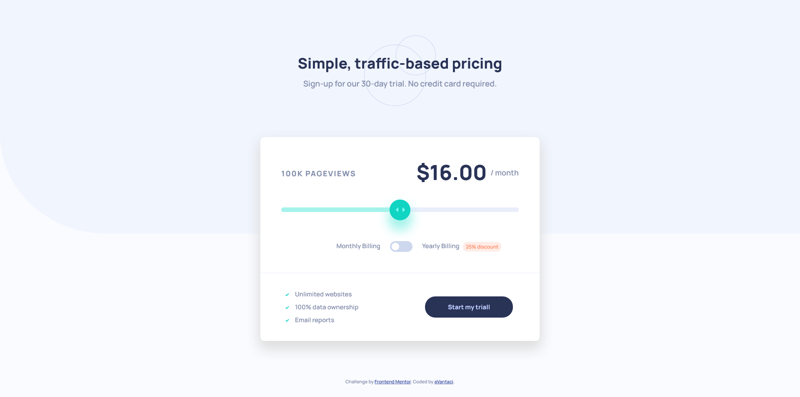

# Frontend Mentor - Interactive pricing component solution

This is a solution to the [Interactive pricing component challenge on Frontend Mentor](https://www.frontendmentor.io/challenges/interactive-pricing-component-t0m8PIyY8). Frontend Mentor challenges help you improve your coding skills by building realistic projects. 

## Table of contents

- [Overview](#overview)
  - [The challenge](#the-challenge)
  - [Screenshot](#screenshot)
  - [Links](#links)
- [My process](#my-process)
  - [Built with](#built-with)
  - [What I learned](#what-i-learned)
  - [Continued development](#continued-development)
- [Author](#author)

## Overview

### The challenge

Users should be able to:

- View the optimal layout for the app depending on their device's screen size
- See hover states for all interactive elements on the page
- Use the slider and toggle to see prices for different page view numbers

### Screenshot



### Links

- Solution Toggle Switch: https://www.w3schools.com/howto/howto_css_switch.asp
- Solution Range Sliders: https://www.w3schools.com/howto/howto_js_rangeslider.asp

- Live Site URL: https://avantaci.github.io/3-interactive-pricing-component-main/

## My process

### Built with

- Semantic HTML5 markup
- CSS custom properties
- SASS
- Flexbox
- JavaScript
- Mobile-first workflow

### What I learned

```js
slider.oninput = sliderMechanism
```

### Continued development

At this moment nothing special is on my mind. This project wasn't problematic at all. Only slider and switcher were a something new but i quickly did my job.

## Author

- Frontend Mentor - [@aVantaci](https://www.frontendmentor.io/profile/aVantaci)


